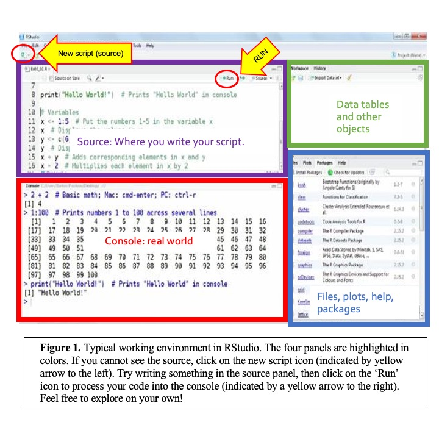
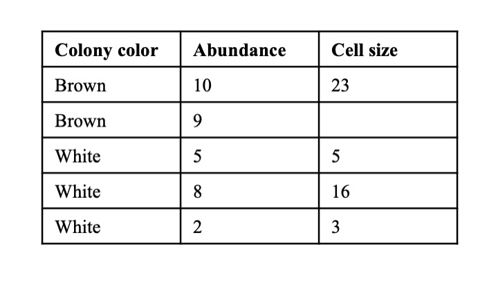
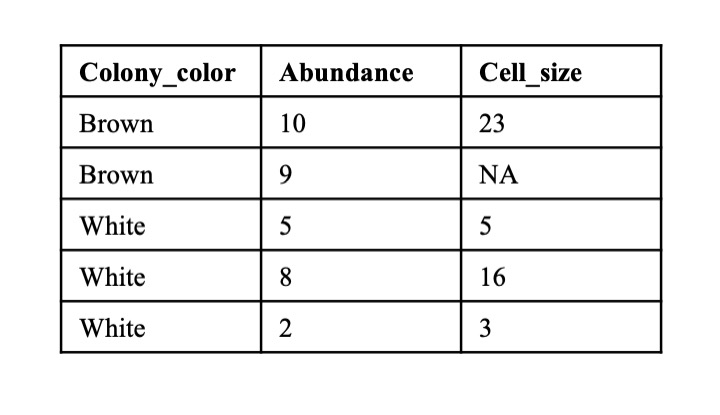

# Tutorial 1: Getting Started with R

Based on a document created by: Jason Pienaar and Tom Miller
Edited by: CCG 2021

## Outline

### Learning objectives:
* Interacting with RStudio
* Recognizing different elements in R and their functionality
* Load  data in R from external tools


What you should have at the end of this tutorial
* A word document with answers to Tasks1-10.
* A script document with the code you produced in this tutorial.
* A basic understanding of how to run basic R code and obtain results.


### Content:
Introduction
Accessing R
Tips for coding
What does it look like and what does it mean?
Simplest tricks in R
R functions
Importing files

## Introduction

Why R?
R is an independent, open source statistical computing environment, incorporating implementations of an older commercial program called “S” by an international team of statisticians. Most other statistics packages are principally orientated towards applying standard methods of data analysis, which is great, but it is difficult to apply non-standard methods or to add to the capabilities of existing methods. This is primarily due to their limited programming capabilities. In addition, they are pretty expensive and require new licensing agreements etc. One of the great strengths of R (other than that it is free) is the relative ease with which new capabilities can be added (the R language is really easy to use). Thus, the user can easily create new functions or combine existing functions or data BUT in order to use R we need to learn the R language hence the simple tutorials.
 
The truth about R:
1- There is nothing more frustrating than when your code does not work
2- There is nothing more satisfying than when your code does work!

Anything worth doing, from losing weight to getting a degree, takes time. Learning R is no different. Especially if this is your first experience programming, you are going to experience a lot of headaches when you get started. You will run into error after error and pound your fists against the table screaming: “WHY ISN’T MY CODE WORKING?!?!? There must be something wrong with this stupid software!!!” You will spend hours trying to find a bug in your code, only to find that - frustratingly enough, you had had an extra space or missed a comma somewhere. You’ll then wonder why you ever decided to learn R when (::sigh::) Excel was so “nice and easy.”

## Accessing R 

### on HSU virtual labs:
Although you can download in your personal computer (and you are encouraged to do so – find instructions on Canvas), we will work on a standardized set up on the school virtual lab (vlabs). To access vlabs:
* [Click Here] (https://vlab.humbold.edu)
* Access ‘vLab- Fall 2020’ or 'Desktops'
* Log in with your HSU information
* Go to the search icon to the bottom left and search : ‘Rstudio’
* Open R studio
 
### Obtaining your own copy of R
Both PC and Macintosh versions of R can be downloaded from the [R home page] (http://www.r-project.org/)
 
## Before you start 

### Best practices

### Tips to learn to code
* PRACTICE! A good practice consists on writing code. Do not copy and paste, do not assume that you got it by reading the tutorial: type it yourself.
* A better practice is to make sure you understand what each line of code is doing. Use # to annotate your code (see below to find out what I mean).
* Keep a notebook with these explanations: ‘File_tutorial2.R line 102: this function sums all the numbers in a vector’. 

### Some R resources
[Useful R Reference Cheatsheet by Tom Short](https://cran.r-project.org/doc/contrib/Short-refcard.pdf)
[Basic skills by Quick R](https://www.statmethods.net)
[Advanced skills Cheatsheet by Arianne Colton and Sean Chen](https://rstudio.com/wp-content/uploads/2016/02/advancedR.pdf)
[Other resources from YaRrr! The pirate’s guide to R](https://bookdown.org/ndphillips/YaRrr/r-resources.html)

## What does it look like and what does it all mean
 
 
Figure 1 is a typical workspace in Rstudio, with four panels. You may have to open a new script (source) when you open the program for the first time: click on the new script icon to the top-left corner (see Fig 1, indicated with a yellow arrow)The most important panels right now are on the left, the source and the console. The source code in the top-left corner is where you will type your code and save your script. The console is where the code runs. You can write code directly to the console to find whether it works or not, or the answer to a calculation. You can also send your code from the source to the console to run. Importantly, you will be saving your source code, if you are typing in the console, you will be unable to save your progress or reuse your code. Therefore, I recommend you ALWAYS type and work on the source panel and send your code to run and see the output on the console. The panels on the right will display your data tables, plots, help and other features, but we will get to those later.
 
### Task 1
In these tutorials, you will regularly find tasks interspersed with guidelines and code. In these tasks, you have to use the code you learned to complete some challenge, then upload a document with the results from each task (see provided example). Task 1 consists of some very simple exercises in R. Answer these on a separate word document and upload to your Canvas assignment page once you are finished.
a. Try typing ‘5’ in your source code, or any other number or letter, and then click on ‘Run’, near the top-right of the source panel. What happened?
b. We can type comments on the source code that don’t run on the console by using ‘#’. Anything written to the right of the ‘#’ will not run. Try typing: ‘5 # is my favorite number’ in the source, and click on ‘Run’. What happened?
c. Save your script: On the RStudio top menu, select save as, and save your script (right now you should have 2 lines, if you answered a and b above) as ‘myfirstscript.R’. Save all your progress from this tutorial and upload the script file to your Canvas assignment as well.

### Saving your work
As with any other type of file, you need to save your scripts for later use. When working in R or Rstudio, you will be saving the Source code. This is a common misconception: you will not be saving the output in the console, so make sure you are typing your code in the Source code window and then running it, otherwise you risk losing your work and being unable to replicate it. In R studio, go to File and Save as, just like you would with other types of documents. 

When working in vlabs: Make a folder with your name in the Desktop and store all your files in there (scripts, outputs, data files). You will then need to send these files to yourself using your Google Drive, Dropbox or email. IMPORTANT: do not log out of vlab before you store your files in the cloud! The files will be deleted when you log in and you will lose your work. 
 
## The Simplest Tricks with R:

### Basic arithmetic
Open the R program by double clicking on the R icon. Under the opening message, you will find the “>” prompt, waiting for you to ask R to do something. Data analyses in R proceeds as an interactive dialogue. We type an S statement at the > prompt, press Enter, and the interpreter executes the statement, i.e. by returning a result, producing graphical output or sending output to a file or device. Try typing in the following simple arithmetic examples (just type what follows the prompt > and then <kbd>Enter<kbd>).

```
2+3
2-3
2*3
2/3
2^3
4^2-3*2
(2-3)*(2*3)
```

The usual precedence for mathematical operators is followed (multiplication and division first, then addition and subtraction). In general, R ignores spaces and so they are not necessary, but for bigger expressions spaces may improve the readability.
 
### Task 2
In these tutorials, you will regularly find tasks interspersed with guidelines and code. In these tasks, you have to use the code you learned to complete some challenge, then upload a document with the results from each task (see provided example). Task 1 consists of doing simple calculations in R. In the document you turn in, show your code and the answer for each one.
Example:

```
455*544

```

You should get:
> 455*544
> [1] 247520
 
Run the following calculations:

```
49923*199
3333+111
322+543 * 234+23
```

And: The year you were born – today’s date (just the day) * your favorite number


## R functions
R is a functional programming language meaning that pretty much everything we do in R is in terms of functions. R includes hundreds of built-in functions for mathematical calculations (including matrix algebra, which is extremely useful in statistics), data analyses, graphing, etc. Values passed to functions are specified within parenthesis after the function name. Here are some simple examples to try:

```
log(100)
log(100, base=10)
seq(1, 4)
seq(2, 8, by=2)
seq(0, 1, length=11)
```

To obtain help or additional info on a function, type ? before the function name or help(function name) and press Enter. (Note: the function log returns the natural log).
 
### Task 3
Explore the functions seq and rep. Use the help to find more about them. Explain what they do in your own words and show an example for each (code and output).
 
## Data types and data structures

### Variables and Vectors
Most R functions (including the simple arithmetic ones from above) can operate on more complex data structures that individual numbers. The simplest data structure (and one that we will use often) is a vector. To construct a vector use the c function

```
c(1, 2, 3, 4)
```

The “c” function combines all the numbers you provide into a vector or a list. From now on, we will give these vectors a variable name so that we can re-use them. To do this simply assign a name to the vector using “=” symbol and press Enter (some may prefer the old assignment symbol of “<-“, but “=” is simpler and more intuitive). Note that R is case sensitive so Vector1 and vector1 are not the same variable.

```
Vector1 = c(1, 2, 3, 4)
```

To see what is stored in the variable simply type the variable name and press Enter (that is, now type “Vector1”, hit return, and R will show you Vector1). The sequence operator from above (seq) also returns a vector. Functions applied to vectors operate on an element-wise basis. Thus:

```
Vector2 = log(Vector1)
```

returns the natural log values of the elements stored in Vector1 and then stores them in the variable Vector2 (note: you will probably use this at some point to log-transform a variable). The rules for naming variables in S are simple: variable names are composed of letters (a-z, A-Z), numerals (0-9) and periods (.) and can be of any length (the first character cannot be a number, and spaces are not allowed). Consequently, variables can be given descriptive names so that you don’t forget what the variable is. For example: “this.is.a.variable.containing.log.values.for.vector1” is a valid variable name. Stupid, maybe, but valid.

```
this.is.a.variable.containing.log.values.for.vector1 = log(Vector1)
```

However, remember that you will have to type it out again to recall the variable. Unlike in many programming languages, variables in S are dynamically defined and redefined so we do not need to tell the interpreter how many values, what type (real, integer etc) or whether it is numeric or a character. We can also redefine a variable simply by assigning it to a different function e.g.

```
Vector2 = rnorm(100)
```

Here the previous values in Vector2 are replaced by 100 standard-normal random numbers (the default mean = 0 and standard deviation = 1, we could easily change these defaults eg: rnorm(20, mean=25, sd=17) returns a vector containing 20 numbers drawn randomly from a set of normally distributed numbers with mean 25 and standard deviation 17). If we wish to print only one of the elements of a vector we index the element using square brackets as in the following example.

```
Vector2[21]
```

returns the 21st element of the vector.

### Lists
While vectors only contain numbers, lists can contain mixed types of elements in R. You can find numbers, strings (characters), logical arguments and even lists nested within lists. 

Create a list using the following code:

```
list_data=list(color='red', vector=c(21,23,43), password=TRUE, Temperature=21.5)
print(list_data)
```

Notice how printing your list gives you each of the stored pieces of information in order, regardless of their class. You can inquire about the types of data you have at each position of the list:

```
list_data[3]
class(list_data[[3]])
```
Uh! Logical class. This class of elements in R indicate true or false statements. We had not run into these before. If you try the other elements in the list you will find numeric, character strings and lists. The next layer of complexity is data frames and matrices, but, importantly, by now you have probably realized that R is much more than just a calculator. It can manipulate data, conduct much of the same statistics covered in SAS, JMP, Canoco, etc., and has excellent graphic capabilities. It can also serve as a programming language. We will cover examples of these in subsequent days of this workshop.

Let's practice some of these skills before we move on.
 
### Task 4
Practice your skills with variables and vectors! For each of the following items, show your code and your output.
1. Create a variable “random.set” containing 300 elements, randomly drawn from a normal distribution of elements with a mean of 2 and standard deviation 0.5.
2. Create a second variable that contains the natural log values of the above elements
3. Use the function mean to return the means of the two variables
4. Use the function var to return the variances of the two variables
5. The function “plot” will create a separate window on your screen with a standard
labeled plot. Type plot(variable) to create a scatter plot of your variables against their indices, substituting your variable name into the brackets, and also plot(variable1, variable2) to plot your variables against each other. Paste your plot to the document you turn in.

### Task 5: 
To explore the different types of elements in R, you will explore some functions on your own. Feel free to google and talk to your peers to complete this task. Make sure you understand the main difference between the classes and functions mentioned here. In your own words explain what these functions do:
is.character()
as.character()
is.numeric()
as.numeric()
is.logical()
as.logical()
factor()
class()
Test them on the variables you have created so far: Vector1, Vector2, this.is.a.variable.containing.log.values.for.vector1, list_data. What types of elements have you worked with so far? 

## This is the end of the morning activity
Good job! You have completed the first session of our Bioinformatics Workshop. We will be meeting again for the afternoon session. **Make sure you save your files to the cloud (they will be deleted from vlab once you log out!)**. You can also directly submit to Canvas if you have completed all the work. See you soon!

## Importing Files
Three Steps for Reading Files or Data Into R:
 
### 1. Changing the Working Directory:
First however, we need to tell R which directory we are using. This is equivalent to answering the question: where are your files in the computer? When using R, it is much easier to have all the files you are going to use organized in one folder or directory.
 
Here, I will provide guidelines to save your progress in your google drive and access a working folder in the school computer via ‘vlab’. I will insist we all do this for now to have the same set up for the purpose of the class. However, if working on your own computer, you can save your progress in the same folder you direct R to (see In your computer section below).
 
#### Google drive
Make a folder called ‘Rtutorials_MicrobEcol2020_drive’. Use it to save and store files with your progress in R tutorials.
 
#### In vlab
Once you have logged in, navigate to ‘Documents’ and create a folder specifically for your R tutorial and associated files called ‘Rtutorials_MicrobEcol2020’. You may need to do this every time you log into vlab, so make sure you any progress you make back into your google drive folders.
 
Once you have a folder, tell R where it is. Open Rstudio, navigate to the menu at the top of the screen and click on Session (should be in the center). Select Set writing directory and then Choose Directory… in order to find the your folder. Navigate to Documents and select your newly created folder  ‘Rtutorials_MicrobEcol2020’.
 
#### (optional) In your computer
Create a folder, provide a clear name and save it in a place you know well. Save all files related to these R exercises within this folder. Use the above instructions to set the writing directory within Rstudio.
 
#### (advanced) Use the command to set the writing directory
setwd() function in R determines the writing directory (see help(setwd)))
getwd() function in R tells you where the writing directory is located
 
### 2. Preparing the data file in Excel (or other program)
We are going to focus on 4 simple ways to get files or data into R. But, before we do this, we are going to create a very simple data set in Excel to use for the rest of the exercise. R supports rectangular data sets (matrices) in the form of “data frames” where the rows represent observations or measurements and the columns represent variables. The data frame is the object that we will use most often to read in and store data to be analyzed.
 
### Task 7. Open Excel and create a file with 3 columns labeled “colony color”, “abundance”, and “cell size”. For color enter: brown, brown, white, white, white. For abundance, enter: 10, 9, 5, 8, 2. For size, enter: 23, (leave this cell empty), 5, 16, 3. Save this table in your folder as ‘Table1R’.
 


Now, we want to get this data into R. But, I will not work (and I will prove this to you later).
 
We intentionally started with a file that R cannot read. It has a couple of common problems that need to be fixed before any file can be brought into R.
* Variable names (the column names) must follow the R rules.
* Missing values must be converted to a form that R recognizes.
Remember the rules for naming variables given in Tutorial 1: variable names are composed of letters, numerals, and periods (.) and spaces are not allowed. Missing values are frequently a source of problems for different analysis and graphing programs. The simplest way to ensure that R recognizes missing values is to convert them to “NA”. Let’s fix our data table.
 
### Task 8. To fix the table, change the variable names from “colony color” to “colony.color” and from “cell size” to “cell.size”. Save the new table as ‘Table1R.fixed’. It should look something like:


 
### 3. Reading the Data into R:
There are a few ways to enter this data into R. Here we will explore importing data stored in excel files. In R, each data set will be referred to as a “data frame” and be given a name – in our example, we will create the data frame called * * bacteria * *.
* The simplest type of file to read into R is a plain text file created in notepad. However, most of us don’t use simple text files, but instead use something like Excel for entry and database management. Standard Excel files (“.xls”) have lots of extra hidden coding that is necessary for Excel, but makes it difficult for other programs to read these files. We could cut and paste the Excel file data into a text editor, but this would be involving a 3rd program as a translator between two others, which is getting a tad ridiculous. So, let’s consider some more practical steps.
* Most programs can write the output as text files. Then, the text files can be read straight into R. R simply requires that there be “white space” between the variables in each row of the data: this may be tabs or actual spaces. So, simply use “Save As . . .” to save the data file from Excel as “Text (tab delimited)” and name it “Table1R.txt”. To be able to compare good tables to poorly formatted tables, do this again for your corrected table and name it “Table1R.fixed.txt“. Then, the file can be read into R using the following commands (we will call the data frame “bacteria”):

```
bacteria = read.table(“TableR1.txt”, header=T)
```

You will probably get an error here. Remember we talked about how that table was wrongly formatted? Lets take a moment to talk about **error messages**.

### Task 9. Reflecting on the errors that R gives you is one of the most important skills you will develop as a coder. Soon, you will be able to interpret these easily (or many of them) and fix your mistakes. To complete this task, answer the following questions regarding this error:
a.     What does this error say?
b.     What do you think it means? What does it mean by ‘line 2’? by ‘elements’?
c.     How to fix it? (hint: you already fixed it – see your TableR1_fixed – explain why this fixes it.
d.     What does it normally mean to you when someone says you made an error? How does it compare to these error messages? How can we make progress unless we try things and learn from our mistakes? (answer in 5 sentences or less).
 
Now that you have interpreted and reflected on the error message, let’s continue with the correct table. Make sure to save it as a tab delimited file.

```
bacteria = read.table(“TableR1.fixed.txt”, header=T)
```
This command finds the file and recognizes that there are labels (“headers”) for each variable. The “T” stands for TRUE and must be capitalized. The second command (“bacteria”) simply causes the file to be printed. The data file will now be available for use in R.

You should no be able to take a look at your data frame in R, by just typing the name of the object

```
bacteria
```

You can also inquire as to what type of object it is

```
class(bacteria)
```
You can also explore the contents of your data frame by looking at specific cells, columns or rows. This is a critical skill when you are working with large datasets.

```
bacteria[1,1]
bacteria$Abundance
bacteria[1,]
bacteria[,1]
```

### Task10
In your own words describe how to use the brackets and the $ sign to find:
The data point for the cell size of the second brown colony 
All the information from the second white colony (Abundance and cell size)
All the cell size data in a vector
The average of all cell sizes
The sum of all Abundances
 
### Importing files Summary 
Often, the most frustrating part of using any program is trying to figure out how to get your data files into the program so that you can start analyzing it. The point of the above was to provide a simple demonstration of how to do this in R. There are many other ways to do this, like reading in data directly from Excel or some other statistics program, but the procedures above works every time and is by far the simplest. Here is a quick summary of how to get your data into R and make the variables available for further analyses:
a)     Get your data into excel, making sure that it is in correct R format for dealing with variable names and missing values. Save as a text file, comma (csv) or tab (txt) delimited.
b)    Open R and make sure you have the working directory set correctly. Use getwd() to check.
c)     Import your data:

```
myfile = read.table(“filename.txt”,header=T)
```

### Task 11 (optional): Beyond the introduction
Some of these exercises go beyond what we have covered in the tutorials. We are intentionally trying to get you to figure out R on your own because it is, by far, the best way to learn how to code. You can find more tutorials, exercises and code online to practice - you can start with the resources we provide on the Canvas page. If you stay motivated, you will begin to see how powerful these skills can be in your professional life. 
Have fun with this one:
1. 	Use Excel to create a rectangular data set with 2 columns, the first which contains 200 random numbers under the heading knock.knock (e.g., in box A1, type “knock.knock”, then in box A2 type “=Rand( )”, hit return, then drag the function down across 200 cells). In the second column, under the heading whos.there, add the values in the first column to a second set of random numbers (e.g. in cell B2, type “=(a2 +rand( ))”, then drag down across 200 cells matching those in column 1).
2. 	Save this as a text file (Text (tab delimited)) named corrie.txt.
3. 	Open R and create a data frame of the data in corrie.txt named corrie.who.
4. 	Let’s use this data a bit. Before we can use the data, make sure you have used the
attach function, because this allows us to now just use column names.
>attach(corrie.who)
To create a scatter plot of the two variables in your file, use the plot function.
>plot(variable1,variable2)
I guess you have to use your own column names…
5. 	I guess one could name this scatter plot corrie.lation (this is a very sad joke and should not be taken too seriously). One can label axes and the graph itself in a variety of ways. Try using the “help(plot)” function to figure out how to correctly label the axes and create a title for the graph.
6. 	Create a histogram of the whos.there variable using the function hist.


